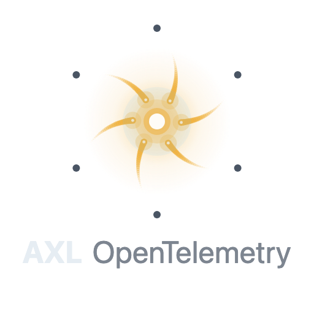
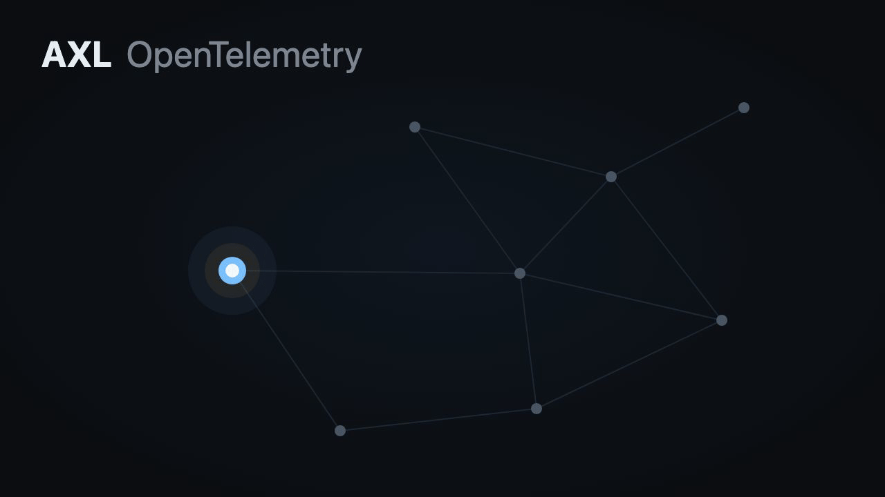
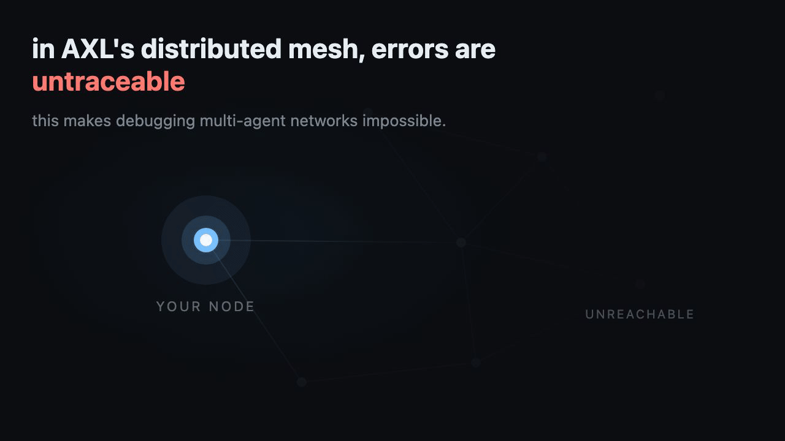
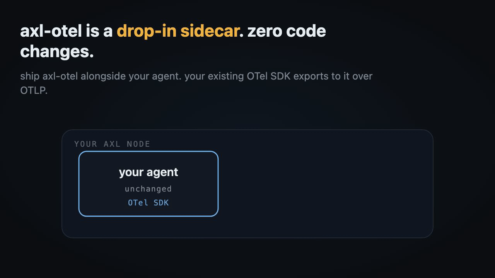
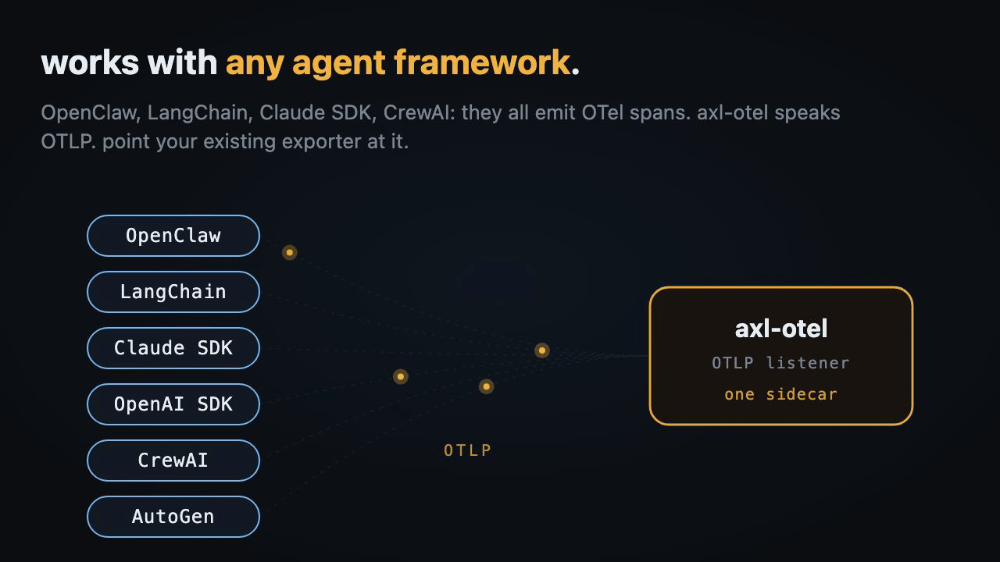
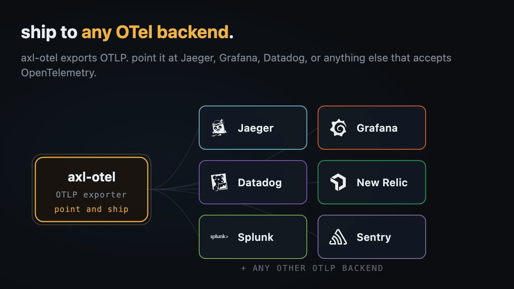
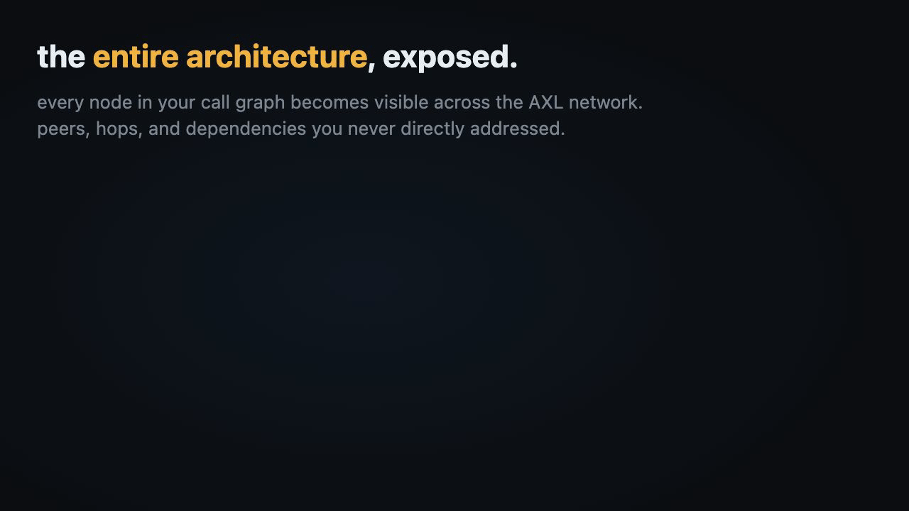
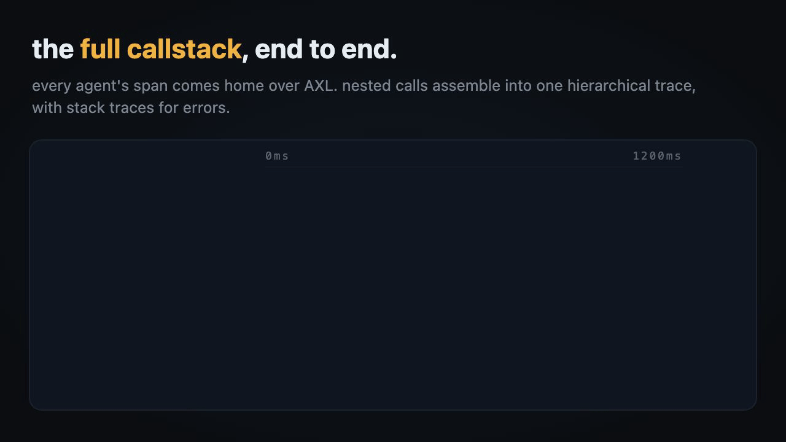

<div align="center">
  

  <p><strong>Distributed tracing for AXL agent meshes.</strong></p>
  <p>
    Drop-in OTLP sidecar. Every span from every agent flows back
    to the originator. No central collector, no shared infra.
  </p>

  

  <p>
    <a href="SPEC.md">Spec</a> &middot;
    <a href="https://axl-otel-demo.boilerroom.tech/">5-agent demo</a> &middot;
    <a href="https://docs.gensyn.ai/tech/agent-exchange-layer">About AXL</a>
  </p>
</div>

---

## The problem



[AXL](https://docs.gensyn.ai/tech/agent-exchange-layer) is peer-to-peer.
You address peers by ed25519 public key, your peers address peers
*you've* never heard of, and three hops in somebody's agent crashes.
Now what. There's nothing in your logs. No stack, no trace, no path
back. The deeper the call chain runs, the darker it gets.

## The solution

OpenTelemetry already solved distributed tracing. Every major language
has SDKs, every backend takes OTLP, every agent framework already
emits spans. The missing piece is a transport that fits AXL's
encrypted, identity-addressed mesh. **That's `axl-otel`.**



Drop a sidecar next to your agent. Point your existing OpenTelemetry
SDK at it via `OTEL_EXPORTER_OTLP_ENDPOINT`. Done. Your agent code
doesn't change. No axl-otel library, no imports, no wrappers.

### Works with any agent framework



LangChain, OpenClaw, Claude Agent SDK, OpenAI Agents, CrewAI, AutoGen
— they all emit OpenTelemetry spans already. `axl-otel` takes standard
OTLP. Whatever you're using, in whatever language, over whatever
transport (MCP, A2A, plain HTTP, gRPC). Plug it in.

### Ships to any OpenTelemetry backend



Once spans land at the originator's sidecar, they go out as plain
OTLP to whatever backend you want. Jaeger, Grafana Tempo, Datadog,
New Relic, Splunk, Sentry, anything OpenTelemetry-compatible. No
vendor lock-in.

## What you see

### Every node in your call graph



Peers, hops, dependencies you've never directly addressed — all of
it lights up. The actual shape of the distributed call, not just your
immediate neighbors.

### The full callstack, end to end



Every agent's span comes home. Nested calls across peers you never
directly talked to assemble into one hierarchical trace. Stack traces
attached to errors.

## Install

Ships as a Docker container and a single statically-linked binary.
Pick whichever fits.

**Docker** ([container registry](https://github.com/Metroxe/axl-otel/pkgs/container/axl-otel))

```bash
docker pull ghcr.io/metroxe/axl-otel:latest
```

**Standalone binary** ([releases](https://github.com/Metroxe/axl-otel/releases/latest)) — statically-linked builds for `linux-x64`, `linux-arm64`, and `darwin-arm64`.

## Quick start

```yaml
# docker-compose.yml
services:
  agent:
    image: my-agent:latest
    environment:
      OTEL_EXPORTER_OTLP_ENDPOINT: http://axl-otel:4318
      OTEL_SERVICE_NAME: my-agent

  axl-otel:
    image: ghcr.io/metroxe/axl-otel:latest
    environment:
      AXL_URL: http://axl:9002
      OTLP_URL: http://jaeger:4318
    # On the originator's machine, also poll AXL for inbound spans:
    command: ["--receive"]

  jaeger:
    image: jaegertracing/all-in-one:latest
    ports:
      - "16686:16686" # UI
```

Two things on the agent side, both standard OTel ecosystem features.

1. Set `originator_peer_id` as an OpenTelemetry baggage entry at the
   start of any workflow you want traced. Value is your local AXL
   node's ed25519 peer ID.
2. Register the standard `BaggageSpanProcessor` so baggage entries
   get stamped onto spans as attributes at span-start.

That's it. No axl-otel client library to import. No protocol-specific
glue.

See [`example/`](example/) for a fully reproducible 5-agent demo
(`Editor → Researcher → Web-Search` and `Editor → Fact-Checker →
Citation-DB`) running on a local Docker bridge network.

## How it works

For every span the sidecar receives over OTLP, one of two things
happens.

- If the `originator_peer_id` attribute equals this peer's ID (or is
  unset), forward to the local OTel backend (Jaeger, Datadog, etc.).
- Otherwise, ship the span to the originator's peer ID via AXL's
  `/send` API.

The originator's sidecar runs with `--receive`, polling AXL's `/recv`
endpoint for inbound span messages and forwarding them to its local
backend. Spans converge from every cooperating peer in the call chain
into one trace.

Full architecture, trust model, and protocol details in
[`SPEC.md`](SPEC.md).

## CLI reference

```
axl-otel [--receive]
         [--axl-url <url>]            (env: AXL_URL,           default http://localhost:9002)
         [--otlp-url <url>]           (env: OTLP_URL,          default http://localhost:4318)
         [--listen-host <host>]       (env: OTLP_LISTEN_HOST,  default localhost)
         [--listen-port <port>]       (env: OTLP_LISTEN_PORT,  default 4318)
         [--poll-interval-ms <ms>]    (default 1000)
```
